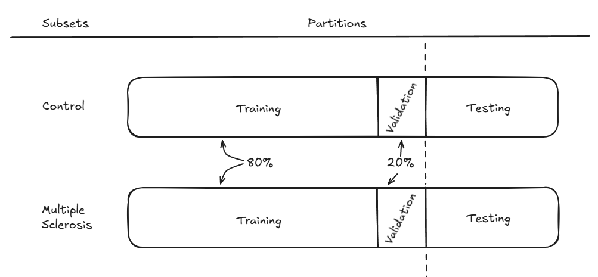

# 📊 Datasets

The dataset used in this project is not sourced from a single origin. Instead, it combines two independent acquisition sites into a unified dataset for Multiple Sclerosis (MS).

- **Pathological data:** MS lesion cases from the **`MSLesSeg`** dataset [[1]](#ref-1).
- **Control data:** Healthy reference subjects from the **`ds004199`** epilepsy dataset [[2]](#ref-2), excluding all epillepsy/FCD patient scans.

Both groups went through an identical preprocessing pipeline to guarantee homogeneity across sources, despite their different origins. 
Volumes were processed into 2D slices, and each folder was further split into `axial`, `coronal` and `sagital` subfolders. This preprocessed dataset, including the folder structure, slice extraction, and orthogonal-plane organization, was provided by my tutors.

| Group | Identifier | Subjects | Slices |
|---|---|---|---|
| Healthy control | MRIcontrol_kde | 85 | 7,735 |
| Multiple Sclerosis | MRIms_kde | 115 | 10,465 |
| Total | -- | 200 | 18,200 |


## 🏗️ Directory Structure
The dataset follows the directory tree shown below:

```
data/
├──MRIcontrol_kde/
|  ├──imagesTr/
|  ├──imagesTs/
|  ├──labelsTr/
|  └──labelsTs/
└──MRIms_kde/
   ├──imagesTr/
   ├──imagesTs/
   ├──labelsTr/
   └──labelsTs/
      ├──axial/
      ├──coronal/
      └──sagital/
```

## 🔀 Data Partitioning
Both control and MS subsets are split into a training set (`imagesTr`, `labelsTr`) and a test set (`imagesTs`, `labelsTs`). The training set is further divided into training and validation splits, as illustrated in the **Dataset Structure** diagram. 

To prevent data leakage, slices are grouped strictly by subject, so no subject appears in more than one split. This division is controlled by a dataset-specific configuration class (`MSLesSegConfig` in this case), which sets the following split: 

- **80%** of the data to training
- **20%** of the data to validation


*Dataset Structure*

### Resulting Split
| Group | Train | Validation | Test | Total |
| :--- | :---: | :---: | :---: | :---: |
| Healthy Control | 47 subjects (4,277 slices) | 12 subjects (1,092 slices) | 26 subjects (2,366 slices) | **85 subjects** (7,735 slices) |
| Multiple Sclerosis | 74 subjects (6,734 slices) | 19 subjects (1,729 slices) | 22 subjects (2,002 slices) | **115 subjects** (10,465 slices) |
| **Aggregate** | **121 subjects** (11,011 slices) | **31 subjects** (2,821 slices) | **48 subjects** (4,368 slices) | **200 subjects** (18,200 slices) |

## ⚙️ Data Interface
The dataset class returns a **four-element tensor tuple** per request, applying intensity normalization across all tensors. Low-resolution assets are generated deterministically at runtime using the downsampling strategies detailed below. The returned tuple is:

```
(X_HR, Y_HR, X_LR, Y_LR)
```

| Element | Description | Runtime Processing |
|---|---|---|
| `X_HR` | High-resolution image | Normalized |
| `Y_HR` | High-resolution mask | Normalized (binary) |
| `X_LR` | Low-resolution image | Normalized + **bicubic** downsampling |
| `Y_LR` | Low-resolution mask | Normalized (binary) + **nearest-neighbour** downsampling |

## 📚 References

<a id="ref-1"></a>
**[1]** Guarnera, F., Rondinella, A., Crispino, E. *et al.* MSLesSeg: A multi-site MRI dataset for Multiple Sclerosis lesion segmentation. *Sci Data* **12**, 920 (2025). [https://doi.org/10.1038/s41597-025-05250-y](https://doi.org/10.1038/s41597-025-05250-y)

<a id="ref-2"></a>
**[2]** Schuch, F., Walger, L., Schmitz, M. *et al.* A multi-site structural MRI dataset of epilepsy patients and healthy controls. *Sci Data* **10**, 475 (2023). [https://doi.org/10.1038/s41597-023-02386-7](https://doi.org/10.1038/s41597-023-02386-7) — hosted on OpenNeuro as [`ds004199`](https://openneuro.org/datasets/ds004199/).