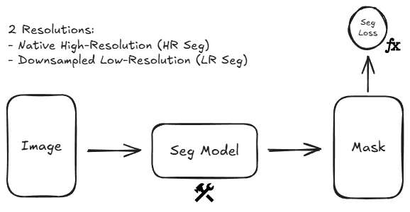
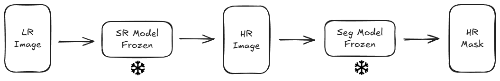
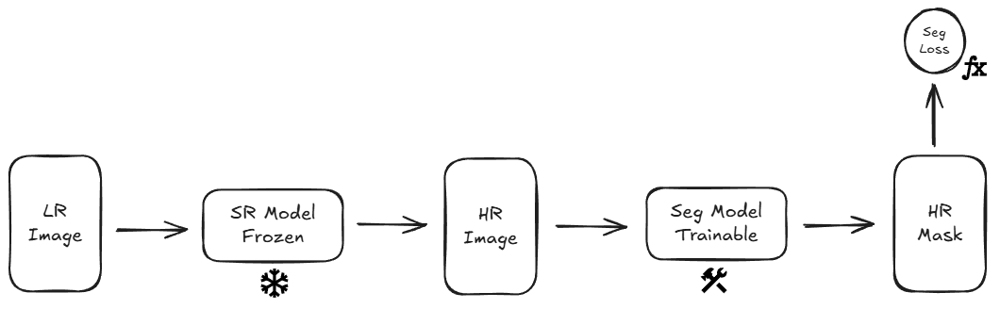
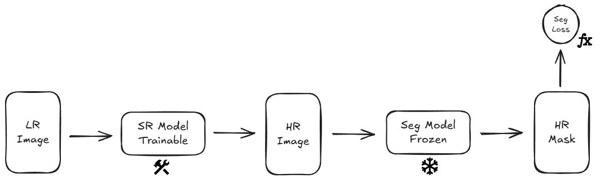
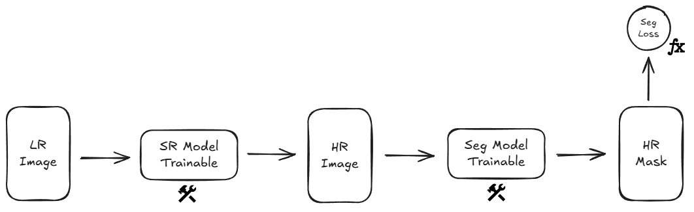
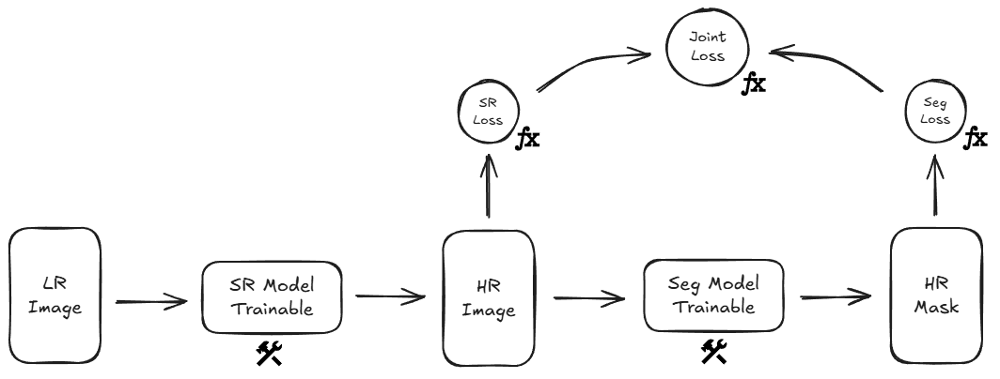
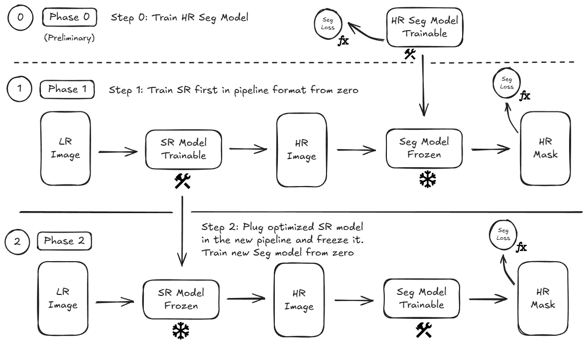
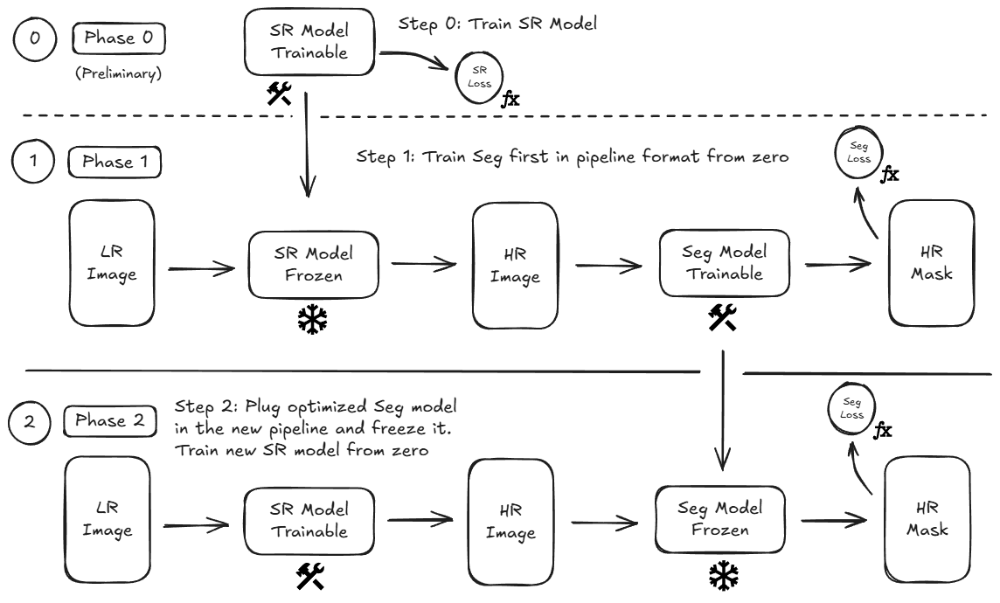

# Pipeline Architectures

This document provides a detailed technical breakdown of the 8 pipeline configurations evaluated in this project.

The experiments use the following architectures: 
- **Super-Resolution (SR):** Custom implementation of the **RCAN** (Residual Channel Attention Network) architecture.
- **Segmentation (Seg):** Use of a **2D UNet** from the library `segmentation-models-pytorch`.

The loss functions used for this setup are:
- **Super-Resolution Loss ($\mathcal{L}_{\text{SR}}$):** Mean Absolute Error ($L_1$ loss)
- **Segmentation Loss ($\mathcal{L}_{\text{Seg}}$):** Composition of Dice loss and Cross-Entropy loss.
$$
    \mathcal{L}_{\text{Seg}} = \frac{1}{2} \mathcal{L}_{\text{Dice}} + \frac{1}{2} \mathcal{L}_{\text{CE}}
$$

The original dataset provides tuples of the form `(image, mask)`. The custom `Dataset` class performs a preprocessing step to obtain tuples of the form `(hr_image, hr_mask, lr_image, lr_mask)`. 

This allows the experiments to work on multiple resolutions and ensures a scientifically consistent experimentation. Without the preprocessing step, pipeline outputs would need to be downsampled prior to evaluation to be able to measure the performance or learning.

## 📌 Pipelines Overview

| # | Configuration | SR weights | Seg weights | Loss |
|---|--------------|-----------|------------|------|
| 1 | Segmentation (baseline) | — | trainable | Seg |
| 2 | SR → Seg | pretrained, frozen | pretrained, frozen | — |
| 3 | SR → Seg | pretrained, frozen | trainable | Seg |
| 4 | SR → Seg | trainable | pretrained, frozen | Seg |
| 5 | SR → Seg (End-to-End) | trainable | trainable | Seg |
| 6 | SR → Seg (Joint Loss) | trainable | trainable | (SR + Seg) / 2 |
| 7 | SR → Seg (Sequential Joint SR First) | (1) Trainable → (2) Frozen | (1) Frozen → (2) Trainable | Seg |
| 8 | SR → Seg (Sequential Joint Seg First) | (1) Frozen → (2) Trainable | (1) Trainable → (2) Frozen | Seg |

## 🔬 Detailed Architecture Breakdown

### Pipeline 1: Baseline (LR Seg & HR Seg)
This configuration serves as the experimental baseline. Concretely, **LR Seg** is set as a reference to be improved, while **HR Seg** is the hypothetical the upper bound. 

Two independent models are trained:
- Low-Resolution Segmentation (LR Seg)
- High-Resolution Segmentation (HR Seg)

Both models are trained on their respective spatial resolutions using the segmentation loss ($\mathcal{L}_{\text{Seg}}$) previously defined.

*Pipeline 1 structure*

### Pipeline 2: Frozen SR --> Frozen Seg
This pipeline is composed of two independently pre-trained models with their weights strictly frozen: a super-resolution network and a segmentation network.

This pipeline is composed of a super-resolution model and a segmentation model. Both models are independently pre-trained and have their weights frozen. 

*Pipeline 2 structure*

### Pipeline 3: Frozen SR --> Trainable Seg
This configuration chains a pre-trained, frozen super-resolution model to a fresh untrained segmentation network. The loss function used for this pipeline is the standard segmentation loss ($\mathcal{L}_{\text{Seg}}$).

*Pipeline 3 structure*

### Pipeline 4: Trainable SR --> Frozen Seg
This configuration connects an untrained super-resolution network with a pre-trained and frozen segmentation model. The loss function used for this pipeline is the standard segmentation loss ($\mathcal{L}_{\text{Seg}}$).

*Pipeline 4 structure*

### Pipeline 5: End-to-End SR-Seg
This pipeline is composed of two untrained models: a super-resolution network and a segmentation network. Both models are optimized at the same time under the same standard segmentation loss ($\mathcal{L}_{\text{Seg}}$). 

*Pipeline 5 structure*

### Pipeline 6: Joint Combined SR-Seg
This pipeline is similar to the previous, it chains an untrained super-resolution network to an untrained segmentation network and trains them together, but the loss function used is the average of both super-resolution and segmentation losses ($\mathcal{L}_{\text{Seg}}$). 

The super-resolution loss is computed directly at the output of the super-resolution model (pred_hr_image) while the segmentation loss is computed as usual, with the final predicted mask (pred_mask).

*Pipeline 6 structure*

### Pipeline 7: Sequential Joint (SR First)
This structure consists of a preliminary phase and two more phases, and the goal is to obtain the benefits of each of these approaches: Trainable SR → Frozen Seg and Frozen SR → Trainable Seg.

The phases consist in:
- **Phase 0 (Preliminary):** Train a segmentation model on high-resolution inputs (**HR Seg**).
- **Phase 1:** Integrate into the pipeline structure the **HR Seg** model trained in Phase 0 and freeze its weights. Initialize a new super-resolution network and leave it trainable. Optimization is performed under the **Trainable SR → Frozen Seg** structure.
- **Phase 2:** Extract the optimized SR model from Phase 1, place it into the new pipeline and freeze its weights. Create a new instance of a segmentation model and place it into the pipeline with trainable weights. Then optimization happens in the structure **Frozen SR → Trainable Seg**.

The learning process happens using the standard segmentation loss ($\mathcal{L}_{\text{Seg}}$) in all three phases.

*Pipeline 7 structure*

### Pipeline 8: Sequential Joint (SR First)
The same principles and goals from the previous pipelines apply here. However, the strategy is changed. 

The phases of this approach consist in:
- **Phase 0 (Preliminary):** Train a super-resolution model (**SR**) to increase the resolution of low-resolution inputs. The loss used is the super-resolution loss ($\mathcal{L}_{\text{SR}}$).
- **Phase 1:** Integrate into the pipeline the trained super-resolution model and freeze its weights. Initialize a new segmentation network with trainable weights. Optimization is performed under the **Frozen SR → Trainable Seg** structure.
- **Phase 2:** Extract the optimized segmentation model from Phase 1, place it into the new pipeline, and freeze its weights. Create a new instance of a super-resolution model and place it into the pipeline with trainable weights. Then optimization happens in the structure **Trainable SR → Frozen Seg**.

Similar to the previous approach, the segmentation loss ($\mathcal{L}_{\text{Seg}}$) guides the optimization of phases 1 and 2, with the difference that the preliminary phase trains a super-resolution model and uses its respective loss function ($\mathcal{L}_{\text{SR}}$). 

*Pipeline 8 structure*
