# 🖼️ Qualitative Results

This document presents a qualitative visual comparison of the segmentation masks generated across all experimental pipeline configurations. These visual results complement the quantitative performance metrics by illustrating how each network architecture handles fine-grained Multiple Sclerosis (MS) lesion boundary delineation and small focal lesion detection.

---

## 📌 Legend & Pipeline Nomenclature

| Subfigure | Pipeline |
| :---: | :--- |
| **(a)** | Input Image |
| **(b)** | Ground Truth |
| **(c)** | (P1) LR Baseline |
| **(d)** | HR Reference |
| **(e)** | P2: Frozen SR $\rightarrow$ Frozen Seg |
| **(f)** | P3: Frozen SR $\rightarrow$ Trainable Seg |
| **(g)** | P4: Trainable SR $\rightarrow$ Frozen Seg |
| **(h)** | P5: Joint E2E |
| **(i)** | P6: Joint Combined (Joint Loss) |
| **(j)** | P7: Sequential Joint (SR First) |
| **(k)** | P8: Sequential Joint (Seg First) |

---

## 🔬 Sample Case 1

<table align="center">
  <tr>
    <td align="center" width="25%">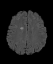 <b>(a) Input Image</b></td>
    <td align="center" width="25%"> <b>(b) Ground Truth</b></td>
    <td align="center" width="25%"> <b>(c) LR Baseline</b></td>
    <td align="center" width="25%"> <b>(d) HR Reference</b></td>
  </tr>
  <tr>
    <td align="center" width="25%"> <b>(e) P2: F-SR / F-Seg</b></td>
    <td align="center" width="25%"> <b>(f) P3: F-SR / T-Seg</b></td>
    <td align="center" width="25%"> <b>(g) P4: T-SR / F-Seg</b></td>
    <td align="center" width="25%"> <b>(h) P5: Joint E2E</b></td>
  </tr>
  <tr>
    <td align="center" width="25%"> <b>(i) P6: Joint Combined</b></td>
    <td align="center" width="25%"> <b>(j) P7: Seq (SR First)</b></td>
    <td align="center" width="25%"> <b>(k) P8: Seq (Seg First)</b></td>
    <td align="center" width="25%"></td>
  </tr>
</table>

## 🔬 Sample Case 2

<table align="center">
  <tr>
    <td align="center" width="25%">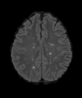 <b>(a) Input Image</b></td>
    <td align="center" width="25%">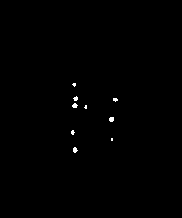 <b>(b) Ground Truth</b></td>
    <td align="center" width="25%"> <b>(c) LR Baseline</b></td>
    <td align="center" width="25%">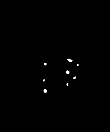 <b>(d) HR Reference</b></td>
  </tr>
  <tr>
    <td align="center" width="25%">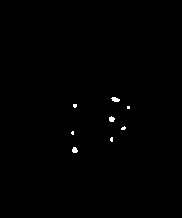 <b>(e) P2: F-SR / F-Seg</b></td>
    <td align="center" width="25%">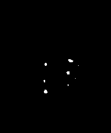 <b>(f) P3: F-SR / T-Seg</b></td>
    <td align="center" width="25%">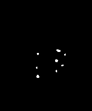 <b>(g) P4: T-SR / F-Seg</b></td>
    <td align="center" width="25%"> <b>(h) P5: Joint E2E</b></td>
  </tr>
  <tr>
    <td align="center" width="25%"> <b>(i) P6: Joint Combined</b></td>
    <td align="center" width="25%">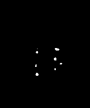 <b>(j) P7: Seq (SR First)</b></td>
    <td align="center" width="25%">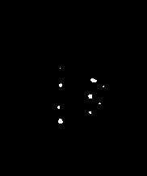 <b>(k) P8: Seq (Seg First)</b></td>
    <td align="center" width="25%"></td>
  </tr>
</table>

## 🔬 Sample Case 3

<table align="center">
  <tr>
    <td align="center" width="25%">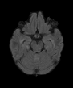 <b>(a) Input Image</b></td>
    <td align="center" width="25%"> <b>(b) Ground Truth</b></td>
    <td align="center" width="25%"> <b>(c) LR Baseline</b></td>
    <td align="center" width="25%"> <b>(d) HR Reference</b></td>
  </tr>
  <tr>
    <td align="center" width="25%"> <b>(e) P2: F-SR / F-Seg</b></td>
    <td align="center" width="25%"> <b>(f) P3: F-SR / T-Seg</b></td>
    <td align="center" width="25%"> <b>(g) P4: T-SR / F-Seg</b></td>
    <td align="center" width="25%"> <b>(h) P5: Joint E2E</b></td>
  </tr>
  <tr>
    <td align="center" width="25%"> <b>(i) P6: Joint Combined</b></td>
    <td align="center" width="25%"> <b>(j) P7: Seq (SR First)</b></td>
    <td align="center" width="25%"> <b>(k) P8: Seq (Seg First)</b></td>
    <td align="center" width="25%"></td>
  </tr>
</table>

## 🔬 Sample Case 4

<table align="center">
  <tr>
    <td align="center" width="25%">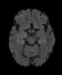 <b>(a) Input Image</b></td>
    <td align="center" width="25%"> <b>(b) Ground Truth</b></td>
    <td align="center" width="25%"> <b>(c) LR Baseline</b></td>
    <td align="center" width="25%"> <b>(d) HR Reference</b></td>
  </tr>
  <tr>
    <td align="center" width="25%"> <b>(e) P2: F-SR / F-Seg</b></td>
    <td align="center" width="25%"> <b>(f) P3: F-SR / T-Seg</b></td>
    <td align="center" width="25%"> <b>(g) P4: T-SR / F-Seg</b></td>
    <td align="center" width="25%"> <b>(h) P5: Joint E2E</b></td>
  </tr>
  <tr>
    <td align="center" width="25%"> <b>(i) P6: Joint Combined</b></td>
    <td align="center" width="25%"> <b>(j) P7: Seq (SR First)</b></td>
    <td align="center" width="25%"> <b>(k) P8: Seq (Seg First)</b></td>
    <td align="center" width="25%"></td>
  </tr>
</table>

## 🔬 Sample Case 5

<table align="center">
  <tr>
    <td align="center" width="25%">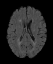 <b>(a) Input Image</b></td>
    <td align="center" width="25%"> <b>(b) Ground Truth</b></td>
    <td align="center" width="25%"> <b>(c) LR Baseline</b></td>
    <td align="center" width="25%">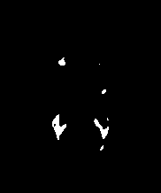 <b>(d) HR Reference</b></td>
  </tr>
  <tr>
    <td align="center" width="25%"> <b>(e) P2: F-SR / F-Seg</b></td>
    <td align="center" width="25%"> <b>(f) P3: F-SR / T-Seg</b></td>
    <td align="center" width="25%">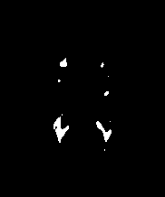 <b>(g) P4: T-SR / F-Seg</b></td>
    <td align="center" width="25%"> <b>(h) P5: Joint E2E</b></td>
  </tr>
  <tr>
    <td align="center" width="25%"> <b>(i) P6: Joint Combined</b></td>
    <td align="center" width="25%"> <b>(j) P7: Seq (SR First)</b></td>
    <td align="center" width="25%">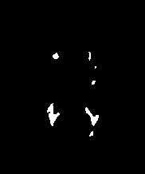 <b>(k) P8: Seq (Seg First)</b></td>
    <td align="center" width="25%"></td>
  </tr>
</table>

## 🔬 Sample Case 6

<table align="center">
  <tr>
    <td align="center" width="25%"> <b>(a) Input Image</b></td>
    <td align="center" width="25%"> <b>(b) Ground Truth</b></td>
    <td align="center" width="25%"> <b>(c) LR Baseline</b></td>
    <td align="center" width="25%"> <b>(d) HR Reference</b></td>
  </tr>
  <tr>
    <td align="center" width="25%"> <b>(e) P2: F-SR / F-Seg</b></td>
    <td align="center" width="25%"> <b>(f) P3: F-SR / T-Seg</b></td>
    <td align="center" width="25%"> <b>(g) P4: T-SR / F-Seg</b></td>
    <td align="center" width="25%"> <b>(h) P5: Joint E2E</b></td>
  </tr>
  <tr>
    <td align="center" width="25%"> <b>(i) P6: Joint Combined</b></td>
    <td align="center" width="25%"> <b>(j) P7: Seq (SR First)</b></td>
    <td align="center" width="25%"> <b>(k) P8: Seq (Seg First)</b></td>
    <td align="center" width="25%"></td>
  </tr>
</table>

## 🔬 Sample Case 7

<table align="center">
  <tr>
    <td align="center" width="25%"> <b>(a) Input Image</b></td>
    <td align="center" width="25%">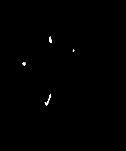 <b>(b) Ground Truth</b></td>
    <td align="center" width="25%"> <b>(c) LR Baseline</b></td>
    <td align="center" width="25%"> <b>(d) HR Reference</b></td>
  </tr>
  <tr>
    <td align="center" width="25%">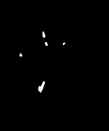 <b>(e) P2: F-SR / F-Seg</b></td>
    <td align="center" width="25%"> <b>(f) P3: F-SR / T-Seg</b></td>
    <td align="center" width="25%">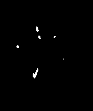 <b>(g) P4: T-SR / F-Seg</b></td>
    <td align="center" width="25%"> <b>(h) P5: Joint E2E</b></td>
  </tr>
  <tr>
    <td align="center" width="25%"> <b>(i) P6: Joint Combined</b></td>
    <td align="center" width="25%"> <b>(j) P7: Seq (SR First)</b></td>
    <td align="center" width="25%"> <b>(k) P8: Seq (Seg First)</b></td>
    <td align="center" width="25%"></td>
  </tr>
</table>